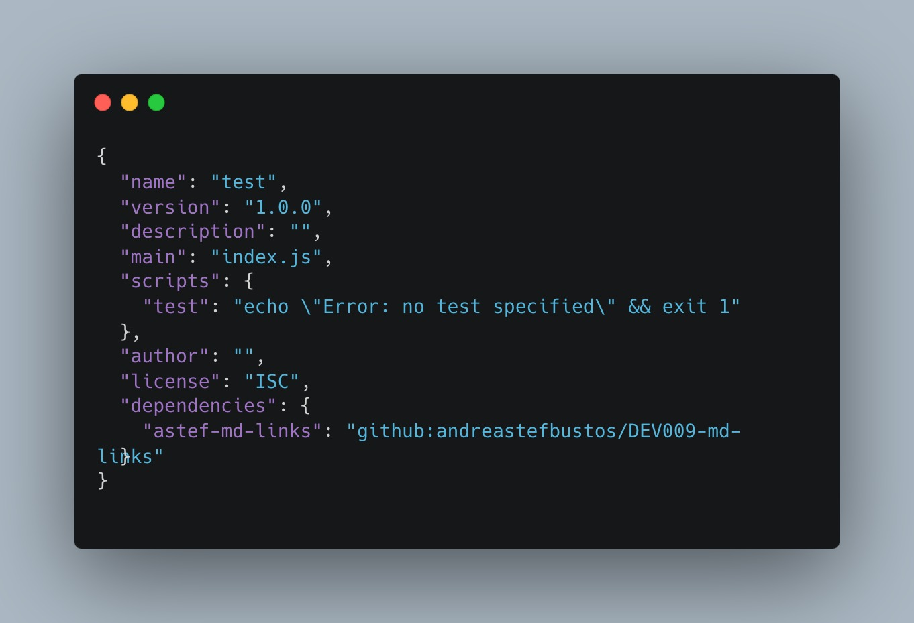
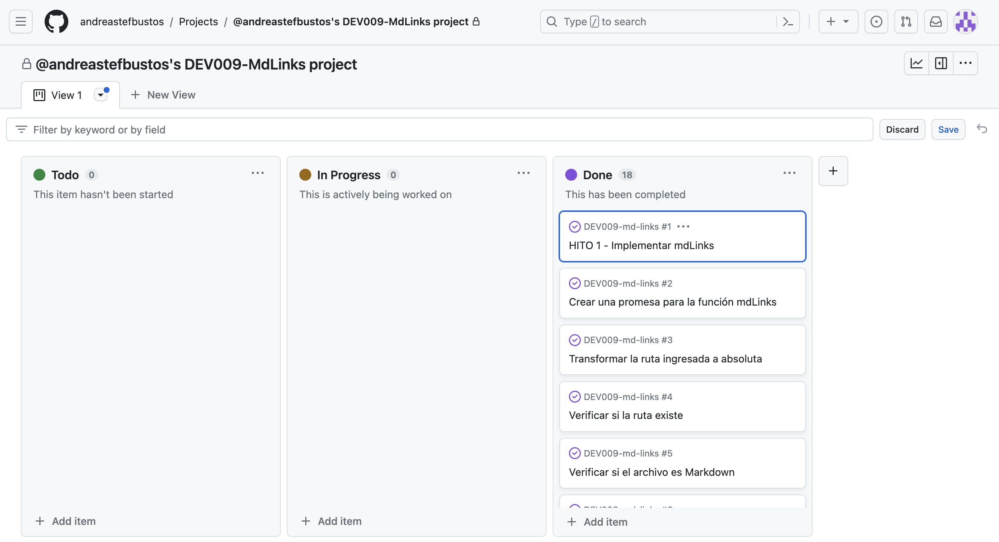

# Markdown Links

## Índice

* [1. Preámbulo](#1-preámbulo)
* [2. Resumen del proyecto](#2-resumen-del-proyecto)
* [3. Documentación](#3-documentación)
* [4. Diagrama de Flujo](#4-diagrama-de-flujo)
* [5. Guía de Uso](#5-guia-de-uso)
* [6. Planificación y Organización del Proyecto](#5-planificacion-y-organizacion-del-proyecto)

***

## 1. Preámbulo

[Markdown](https://es.wikipedia.org/wiki/Markdown) es un lenguaje de marcado ligero muy popular entre developers. Es usado en muchísimas plataformas que manejan texto plano (GitHub, foros, blogs, ...) y es muy común encontrar varios archivos en ese formato en cualquier tipo de repositorio (empezando por el tradicional `README.md`).

Estos archivos `Markdown` normalmente contienen _links_ (vínculos/ligas) que muchas veces están rotos o ya no son válidos y eso perjudica mucho el valor de la información que se quiere compartir.

Dentro de una comunidad de código abierto, nos han propuesto crear una herramienta usando [Node.js](https://nodejs.org/), que lea y analice archivos en formato `Markdown`, para verificar los links que contengan y reportar
algunas estadísticas.


## 2. Resumen del proyecto

`md-Links` es una librería desarrollada en Node.js que ofrece funciones para verificar, leer y analizar los enlaces presentes en archivos con formato `Markdown`. Esta herramienta es especialmente útil para examinar la documentación que deseamos incorporar a nuestros proyectos, ya que nos permite detectar enlaces repetidos, rotos o válidos.

Con mdLinks, podemos asegurarnos de que los enlaces presentes en nuestros archivos Markdown sean correctos y estén funcionando adecuadamente. Además, nos brinda la posibilidad de identificar aquellos enlaces que puedan estar llevándonos a páginas inexistentes o con errores, evitando así posibles problemas para los usuarios de nuestro proyecto.

Gracias a la facilidad de uso y la capacidad de análisis de `mdLinks`, podemos mantener la integridad y la calidad de la documentación de nuestros proyectos, garantizando que los enlaces estén siempre actualizados y en buen estado.

## 3. Documentación 

### 1) JavaScript API

El módulo debe de  **importarse** en otros scripts de Node.js y debe ofrecer la
siguiente interfaz:

```js
// Importar la función mdLinks desde la biblioteca
const { mdLinks } = require('md-links-asb');

// Definir el path y las opciones (si es necesario)
const path = 'ruta/a/tu/archivo.md';
const options = {
  validate: true, // Cambiar a false si no se necesita validar los enlaces
};

// Utilizar la función mdLinks
mdLinks(path, options)
  .then((links) => {
    // Hacer algo con los links obtenidos, por ejemplo, mostrarlos en la consola
    console.log(links);
  })
  .catch((error) => {
    // Manejar cualquier error que ocurra durante la ejecución de mdLinks
    console.error('Error:', error.message);
  });
```

#### `mdLinks(path, options)`

##### Argumentos

* `path`: Ruta **absoluta** o **relativa** al **archivo** o **directorio**.
Si la ruta pasada es relativa, debe resolverse como relativa al directorio desde donde se invoca node - _current working directory_).
* `options`: Un objeto con **únicamente** la siguiente propiedad:
  - `validate`: Booleano que determina si se desea validar los links
    encontrados.

##### Valor de retorno

La función debe **retornar una promesa** (`Promise`) que **resuelva a un arreglo**
(`Array`) de objetos (`Object`), donde cada objeto representa un link y contiene
las siguientes propiedades

Con `validate:false` :

* `href`: URL encontrada.
* `text`: Texto que aparecía dentro del link (`<a>`).
* `file`: Ruta del archivo donde se encontró el link.

Con `validate:true` :

* `href`: URL encontrada.
* `text`: Texto que aparecía dentro del link (`<a>`).
* `file`: Ruta del archivo donde se encontró el link.
* `status`: Código de respuesta HTTP.
* `ok`: Mensaje `fail` en caso de fallo u `ok` en caso de éxito.

#### Ejemplo (resultados como comentarios)

```js
const mdLinks = require("md-links");

mdLinks("./some/example.md")
  .then(links => {
    // => [{ href, text, file }, ...]
  })
  .catch(console.error);

mdLinks("./some/example.md", { validate: true })
  .then(links => {
    // => [{ href, text, file, status, ok }, ...]
  })
  .catch(console.error);

mdLinks("./some/dir")
  .then(links => {
    // => [{ href, text, file }, ...]
  })
  .catch(console.error);
```

### 2) CLI (Command Line Interface - Interfaz de Línea de Comando)

El ejecutable de nuestra aplicación se ejecuta de la siguiente manera a través de la **terminal**:

`md-links <path-to-file> [options]`

Por ejemplo:

```sh
$ md-links ./some/example.md
./some/example.md http://algo.com/2/3/ Link a algo
./some/example.md https://otra-cosa.net/algun-doc.html algún doc
./some/example.md http://google.com/ Google
```

#### Options

##### `--validate`

Si pasamos la opción `--validate`, el módulo debe hacer una petición HTTP paraaveriguar si el link funciona o no. Si el link resulta en una redirección a una URL que responde ok, entonces consideraremos el link como ok.

Por ejemplo:

```sh
$ md-links ./some/example.md --validate
./some/example.md http://algo.com/2/3/ ok 200 Link a algo
./some/example.md https://otra-cosa.net/algun-doc.html fail 404 algún doc
./some/example.md http://google.com/ ok 301 Google
```

Vemos que el _output_ en este caso incluye la palabra `ok` o `fail` después de la URL, así como el status de la respuesta recibida a la petición HTTP a dicha URL.

##### `--stats`

Si pasamos la opción `--stats` el output (salida) será un texto con estadísticas básicas sobre los links.

```sh
$ md-links ./some/example.md --stats
Total: 3
Unique: 3
```

También podemos combinar `--stats` y `--validate` para obtener estadísticas que necesiten de los resultados de la validación.

```sh
$ md-links ./some/example.md --stats --validate
Total: 3
Unique: 3
Broken: 1
```

## 4. Diagrama de Flujo

[Elaboración del Diagrama de Flujo utilizando Figma](https://www.figma.com/file/sheqzkCmGatQZH4VKXpCVM/Diagrama-de-Flujo?type=whiteboard&node-id=0%3A1&t=glXJwBKsNfvwN7cg-1)


## 5. Guía de Uso

### Instalación

Se puede ejecutar de dos maneras:

1. Desde la terminal del usuario, utilizando el repositorio.

```shell
npm install github:andreastefbustos/DEV009-md-links
```



2. Desde la terminal del usurio, utilizando el paquete publicado en npm

Se debe de ejecutar este comando

```shell
npm i md-links-asb
```

"Puedes encontrar el paquete del proyecto publicado en npm haciendo clic [aquí](https://www.npmjs.com/package/md-links-asb)."

### Comandos

1. Accede a la terminal y ejecuta el siguiente comando:

``Input:``
```shell
md-links --help
```

El primer comando mostrará las instrucciones para ejecutar el programa y los ejecutables disponibles.

``Output:``
```sh
Explore the mdLinks Library.


Usage: md-links ./docs [options]

Comandos:
md-links ./docs                         Analyze links in the "docs" folder
md-links ./docs --validate              Verify links and their status
md-links ./docs --stats                 Get statistics of total and unique links
md-links ./docs --validate --stats      Get complete link analysis including broken links
```

Asegúrate de seguir las instrucciones detalladamente para obtener el resultado deseado.

2. Al ejecutar el siguiente comando 

``Input:``
```shell
md-links ./docs
```

Obtendremos un arreglo de objetos con las propiedades:

* `href`: URL encontrada.
* `text`: Texto que aparecía dentro del link (`<a>`).
* `file`: Ruta del archivo donde se encontró el link.

``Output:``
```shell
[
  {
    href: 'https://es.wikipedia.org/wiki/Markdown',
    text: 'Markdown',
    file: '/Users/andreabustos/workdir/laboratoria/DEV009-md-links/data_testing/subFolder/sub1/sub-test.md'
  },
  {
    href: 'https://nodejs.org/',
    text: 'Node.js',
    file: '/Users/andreabustos/workdir/laboratoria/DEV009-md-links/data_testing/subFolder/sub-test.md'
  },
  {
    href: 'https://user-images.githubusercontent.com',
    text: 'md-links',
    file: '/Users/andreabustos/workdir/laboratoria/DEV009-md-links/sub-test.md'
  },
  {
    href: 'https://davichobits.github.io/demo-mdlinks/docs/hitos/hito-4',
    text: 'Markdown',
    file: '/Users/andreabustos/workdir/laboratoria/DEV009-md-links/data_testing/subFolder/test-noLinks.md'
  },
  {
    href: 'https://mdn.github.io/learning-area/javascript/apis/introduction/maps-example.html',
    text: 'Node.js',
    file: '/Users/andreabustos/workdir/laboratoria/DEV009-md-links/data_testing/test-noLinks.md'
  },
  {
    href: 'https://httpstat.us/450',
    text: 'md-links',
    file: '/Users/andreabustos/workdir/laboratoria/DEV009-md-links/test-noLinks.md'
  }
]
```

3. Comando `--validate`

Ejecutar -->

``Input:``
```shell 
md-links ./docs --validate
```

Obtendremos un arreglo de objetos con las propiedades:

* `href`: URL encontrada.
* `text`: Texto que aparecía dentro del link (`<a>`).
* `file`: Ruta del archivo donde se encontró el link.
* `status`: Código de respuesta HTTP.
* `ok`: Mensaje `fail` en caso de fallo u `ok` en caso de éxito.

``Output:``
```shell
[
  {
    href: 'https://es.wikipedia.org/wiki/Markdown',
    text: 'Markdown',
    file: '/Users/andreabustos/workdir/laboratoria/DEV009-md-links/data_testing/subFolder/sub-test.md',
    status: 200,
    ok: 'ok'
  },
  {
    href: 'https://nodejs.org/',
    text: 'Node.js',
    file: '/Users/andreabustos/workdir/laboratoria/DEV009-md-links/data_testing/subFolder/sub-test.md',
    status: 200,
    ok: 'ok'
  },
  {
    href: 'https://user-images.githubusercontent.com',
    text: 'md-links',
    file: '/Users/andreabustos/workdir/laboratoria/DEV009-md-links/sub-test.md',
    status: 200,
    ok: 'ok'
  },
  {
    href: 'https://davichobits.github.io/demo-mdlinks/docs/hitos/hito-4',
    text: 'Markdown',
    file: '/Users/andreabustos/workdir/laboratoria/DEV009-md-links/data_testing/subFolder/test-noLinks.md',
    status: 404,
    ok: 'fail'
  },
  {
    href: 'https://mdn.github.io/learning-area/javascript/apis/introduction/maps-example.html',
    text: 'Node.js',
    file: '/Users/andreabustos/workdir/laboratoria/DEV009-md-links/data_testing/test-noLinks.md',
    status: 404,
    ok: 'fail'
  },
  {
    href: 'https://httpstat.us/450',
    text: 'md-links',
    file: '/Users/andreabustos/workdir/laboratoria/DEV009-md-links/test-noLinks.md',
    status: 450,
    ok: 'fail'
  }
]
```

4. Comando `--stats`

Ejecutar -->

``Input:``
```shell
md-links ./docs --stats
```

Al utilizar esta opción, podrás obtener estadísticas relacionadas con los enlaces presentes en los archivos Markdown.

``Output:``
```shell
$ md-links ./some/example.md --stats
Total: 3
Unique: 3
```

* Los `links Total` representan la cantidad total de enlaces encontrados en los archivos analizados. Cada enlace único se contabiliza, incluso si aparece varias veces en diferentes archivos.

* Los `links Unique` muestran la cantidad de enlaces distintos presentes en los archivos Markdown. Si un mismo enlace aparece en varios archivos, solo se contará una vez en esta métrica.

Utiliza esta opción para obtener una visión general de la cantidad total de enlaces y la diversidad de enlaces únicos en tus documentos Markdown.

5. Comando `--validate` y `--stats`

Ejecutar -->

``Input:``
```shell
md-links ./docs --validate --stats
```

También podemos combinar `--validate` y `--stats` para obtener estadísticas que necesiten de los resultados de la validación.

``Output:``
```sh
$ md-links ./some/example.md --stats --validate
Total: 3
Unique: 3
Broken: 1
```

* `Broken:` El número de enlaces que están rotos o no devuelven un código de estado 200.

### Errores

* Cuando el `./docs` no existe
```sh
md-links ./docs                    
Error: The provided path does not exist. Please provide a valid path.
```

* Cuando las carpetas no tienen archivos 
```sh
md-links ./docs
Error: No Markdown files found in the directory or subdirectories.
```

* Cuando el archivo no tiene la extensión .md `markdown` 
```sh
md-links ./docs.txt                  
Error: The file is not a Markdown.
```

* Cuando los comandos ejecutables son erróneos 
```sh
md-links ./docs --novalidate
Error: The argument '--novalidate' is invalid, the valid options are: --validate, --stats
```

## 6. Planificación y Organización del Proyecto

Este proyecto se desarrolla siguiendo una metodología ágil y aprovecha los tableros de proyectos de GitHub para una organización eficiente y un seguimiento efectivo del progreso.

### Fases del Proyecto

Se ha dividido el proyecto en cinco fases diferentes, cada una de ellas representa una etapa significativa del desarrollo.

[HITOS:paso a paso para la elaboración del proyecto](https://davichobits.github.io/demo-mdlinks/)

### Tablero de Proyectos de GitHub (Github projects)

Durante el desarrollo del proyecto, se utilizó el tablero de proyectos de GitHub para gestionar las tareas y seguir el progreso de manera sistemática. El tablero está organizado en varias columnas que representan diferentes etapas del desarrollo:

1. Por Hacer: Esta columna contiene todas las tareas que están planificadas pero aún no han comenzado.

2. En Progreso: Las tareas en las que los colaboradores están trabajando activamente se mueven a esta columna.

3. Completado: Las tareas que han sido revisadas y terminadas con éxito se trasladan a esta columna.

